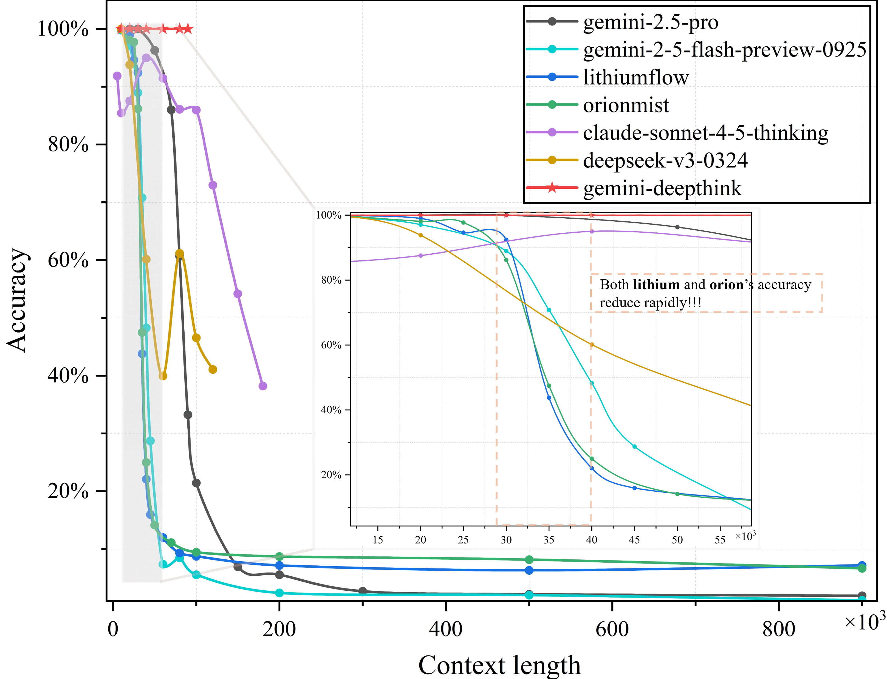
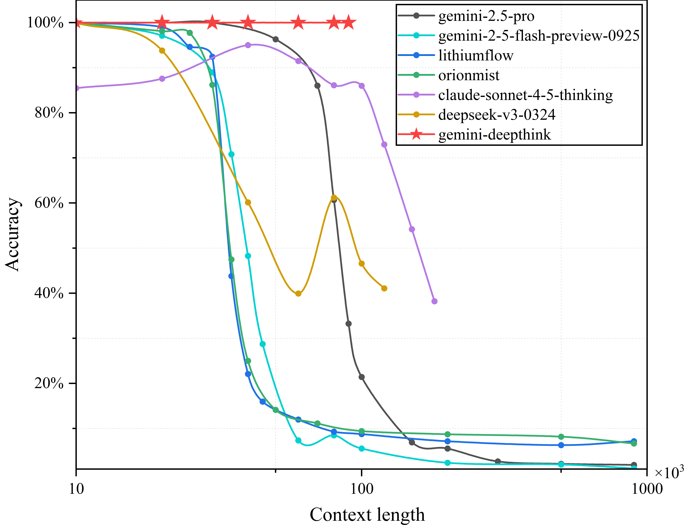

# 大语言模型召回率测试（Needle in a Haystack）

[English](README.md) | 简体中文

## 测试结果

下面是相关的测试结果：

### 全上下文窗口视图


### 对数坐标视图（以10为底）


## 项目简介

本项目通过一种类似于"大海捞针"的方法，对现有主流大语言模型进行召回率的测试。该测试方法在某种程度上可能与模型注意力机制的性能成正相关。

### 测试模型

主要测试了以下模型：
- **gemini-2.5-pro**
- **gemini-2.5-flash-preview-09-2025**
- **claude-sonnet-4-5-thinking**
- **DeepSeek_V3_0324**
- **gemini-deepthink**

除此之外，还对近期比较火的隐藏模型进行了测试：
- **lithiumflow**
- **orionmist**

⚠️ **注意**：除隐藏模型外的测试数据都已开源并存放在 [`test_results/`](test_results/) 目录中。

## 测试方法

### 核心原理

本测试方法通过以下步骤进行：

1. **构造测试文本**：在一个固定token长度的上下文中，随机插入多个四位数（1000-9999）
2. **模型任务**：要求模型从文本中提取所有四位数，并按出现顺序输出为JSON格式
3. **评分算法**：使用基于编辑距离（Levenshtein Distance）的算法对模型回答进行评分

### 评分算法

评分系统基于**编辑距离**算法，能够全面评估模型表现：

- ✅ **惩罚多余的键**（幻觉错误）：模型输出了不存在的数字
- ✅ **惩罚缺失的键**（遗漏错误）：模型遗漏了应该提取的数字  
- ✅ **惩罚错误的值**：提取的数字值不正确
- ✅ **惩罚顺序错误**：数字顺序不符合原文

**准确率计算公式**：
```
准确率 = (1 - 编辑距离 / 最大序列长度) × 100%
```

## 项目结构

```
.
├── 收集数据/                      # 数据生成与收集模块
│   ├── generate_text.py           # 生成测试文本
│   ├── run_batch_test.py          # 批量API测试脚本
│   ├── numbers.json               # 标准答案
│   ├── output.md                  # 生成的测试文本
│   └── 数据库/                    # 测试结果数据库
│
├── 数据分析/                      # 数据分析模块
│   ├── analyze_database.py        # 基础数据库分析
│   ├── analyze_summary.py         # 模型概览统计
│   ├── analyze_errors.py          # 错误类型分析（错位/幻觉/缺失）
│   ├── analyze_position_accuracy.py # 位置准确率分析（LCS算法）
│   ├── create_heatmap.py          # 生成位置准确率热力图
│   ├── create_hallucination_heatmap.py # 生成幻觉错误热力图
│   ├── create_missing_heatmap.py  # 生成缺失错误热力图
│   ├── create_misorder_position_heatmap.py # 生成错位热力图
│   ├── generate_all_heatmaps.py   # 批量生成所有热力图
│   ├── grading_utils.py           # 评分工具函数
│   └── 分析结果/                  # 分析结果数据库
│
├── test_results/                  # 测试结果（按模型分类）
│   ├── gemini-2.5-pro/
│   ├── gemini_2_5_flash_preview_09_2025/
│   ├── claude_sonnet_4_5_thinking/
│   ├── lithiumflow/
│   └── orionmist/
│
├── grading_utils.py               # 评分算法核心
├── evaluate_test.py               # 单次测试评估
├── 答案.json                      # 标准答案示例
├── test.json                      # 测试答案示例
└── README.md                      # 项目说明文档
```

## 使用方法

### 1. 生成测试数据

使用 [`generate_text.py`](收集数据/generate_text.py) 生成测试文本：

```bash
cd 收集数据
python generate_text.py [上下文长度] [插入数量]
```

**参数说明**：
- `上下文长度`：基础字符串长度（默认：50000）
- `插入数量`：插入的四位数数量（默认：40）

**示例**：
```bash
python generate_text.py 30000 50  # 生成30000字符，插入50个数字
```

### 2. 批量测试

使用 [`run_batch_test.py`](收集数据/run_batch_test.py) 进行批量API测试：

```bash
cd 收集数据
python run_batch_test.py [运行次数] [并发数] [请求延迟] [上下文长度] [插入数量] [基础模式]
```

**参数说明**：
- `运行次数`：测试次数（默认：10）
- `并发数`：并发请求数（默认：10）
- `请求延迟`：请求间隔秒数（默认：0）
- `上下文长度`：上下文字节数（默认：30000）
- `插入数量`：插入数字数量（默认：40）
- `基础模式`：基础字符串模式（默认：`"a|"`）

**示例**：
```bash
python run_batch_test.py 20 5 1 30000 50  # 20次测试，5并发，1秒延迟
```

**注意**：需要在脚本中配置：
- API地址（`API_URL`）
- 模型ID（`MODEL_ID`）
- API密钥（`HEADERS['authorization']`）

### 3. 数据分析

#### 基础统计分析

```bash
python 数据分析/analyze_database.py <数据库路径>
```

#### 生成模型概览

```bash
python 数据分析/analyze_summary.py <数据库路径>
```

#### 错误类型分析

分析三种错误类型（错位、幻觉、缺失）：

```bash
python 数据分析/analyze_errors.py <数据库路径>
```

#### 位置准确率分析

使用LCS（最长公共子序列）算法分析位置准确率：

```bash
python 数据分析/analyze_position_accuracy.py <数据库路径>
```

#### 生成可视化热力图

```bash
# 生成所有热力图
python 数据分析/generate_all_heatmaps.py <数据库路径>

# 或单独生成
python 数据分析/create_heatmap.py <position_accuracy数据库路径>
python 数据分析/create_hallucination_heatmap.py <error_stats数据库路径>
python 数据分析/create_missing_heatmap.py <error_stats数据库路径>
```

### 4. 评估单次测试

```bash
python evaluate_test.py
```

此命令会评估 [`test.json`](test.json) 相对于 [`答案.json`](答案.json) 的准确率。

### 数据库存储

测试结果存储在SQLite数据库中，按字节数分表：
- **原始数据**：`bytes_{字节数}` 表存储原始测试记录
- **统计汇总**：`bytes_stats` 表记录已回答次数和解析失败次数

### 分析结果

分析结果存储在独立的数据库中：
- **模型概览**：`model_summary_{模型ID}.db`
- **错误统计**：`error_stats_{模型ID}.db`
- **位置准确率**：`position_accuracy_{模型ID}.db`

### 可视化图表

项目生成多种可视化图表（存放在各模型的 `test_results/` 子目录中）：
- 📊 **平均准确率得分图**：展示不同字节数下的平均准确率
- 🔥 **位置准确率热力图**：展示各位置的正答概率
- 🎯 **幻觉测试热力图**：展示幻觉错误的分布
- 📉 **缺失测试热力图**：展示缺失错误的分布
- 📈 **JSON输出失败概率图**：展示解析失败的概率分布
- 📑 **统计表格**：Excel格式的详细统计数据

## 技术特点

### 错误分析方法

项目使用的算法分析三种错误类型：

1. **错位错误**：使用LCS算法识别顺序正确的数字作为锚点，非锚点的正确值即为错位
2. **幻觉错误**：识别模型输出的不存在于标准答案中的数字，并定位其在锚点间的区间
3. **缺失错误**：统计标准答案中存在但模型未正确输出的数字

### 位置准确率算法

基于**最长公共子序列（LCS）**算法：
- 找出模型回答中与标准答案顺序完全一致的子序列
- 统计每个位置被正确识别的频率
- 生成位置准确率分布图

## 环境要求

### Python依赖

```bash
pip install aiohttp numpy matplotlib seaborn openpyxl
```

### 主要依赖库
- `aiohttp`：异步HTTP请求
- `sqlite3`：数据库操作（Python内置）
- `numpy`：数值计算
- `matplotlib`：图表绘制
- `seaborn`：热力图可视化
- `openpyxl`：Excel文件操作

## 已知限制

### ⚠️ 重要说明：测试结果的适用范围

**当前测试仅代表在 `a|` 这种重复序列内插针的测试结果。** 实际使用时，模型的召回率和注意力很大程度上会受到输入文本的影响。因此，本测试所测出的准确性**只有比较意义，没有绝对意义**。

**请勿直接挪用本测试结果来声称模型在某个上下文长度下的召回率和注意力仅有本测试结果所示的水平。** 不同的输入内容、文本结构和语言特征都可能显著影响模型的实际表现。

**本测试适用于：**
- **横向比较**：在相同测试条件下对比不同模型的表现
- **纵向比较**：评估同一模型在不同上下文窗口下的召回率表现

### DeepSeek 模型测试说明

对于 DeepSeek 的模型，自从 **DeepSeek V3.1** 版本后，其内部引入了某种特殊的注意力机制。这导致使用简单的 `a|` 模式进行测试时，其结果不够准确——具体表现为**在全上下文范围内都有极高的准确率，这是不正常的**。

在更换了插入语言，不使用简单的 `a|` 重复后，DeepSeek 类模型的准确率有了截然相反的结果。这表明该模型可能对特定的重复模式有特殊的优化处理。

**未来计划**：我们将针对这一发现，制作修正版本的测试集，以便更准确地评估包含 DeepSeek 在内的具有特殊注意力机制的模型。

### GPT-5 模型测试说明

此外，我们还测试了 **GPT-5** 模型。然而，GPT-5 模型内部使用了某种**模型路由机制**，这导致了严重的不稳定性问题：

- 在相同的上下文（50k token）测试中，准确率分布极其不稳定，**从 5% 到 100% 大幅波动**
- 100% 的准确率可能代表路由到了其中最好的模型，但这种情况无法稳定复现
- 我们尝试了多种方法来稳定路由结果，包括：
  - 修改提示词内容
  - 调整思考强度设置（即使设为 `high`）
  - 其他各种优化策略

**测试结论**：由于无法获得稳定且可重复的测试结果，GPT-5 类模型的测试集暂不公开。我们将在未来找到更好的测试方法后，再进行公开测试集的发布。

## 引用

如果本项目对您的研究有帮助，欢迎引用！

---

**最后更新**：2025年11月1日
